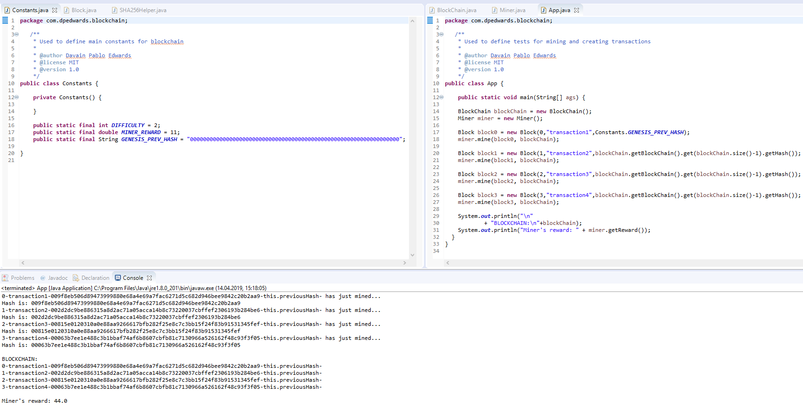

# [Java Blockchain](https://github.com/dpedwards/java-blockchain)

Conceptual Java Blockchain with cryptography process 

## Notable features 

- creating and chaning blocks
- mining 

## Test

## Usage

For detailed instructions on how to configure, customize, add/migrate content, and more read the [project`s documentation](https://github.com/dpedwards/java-blockchain/docs/quick-start-guide/).

---

## Contributing

Having trouble working with the project? Found a typo in the documentation? Interested in adding a feature or [fixing a bug](https://github.com/dpedwards/java-blockchain/issues)? Then by all means [submit an issue](https://github.com/dpedwards/java-blockchain/issues/new) or [pull request](https://help.github.com/articles/using-pull-requests/). If this is your first pull request, it may be helpful to read up on the [GitHub Flow](https://guides.github.com/introduction/flow/) first.

### Pull Requests

When submitting a pull request:

1. Clone the repo.
2. Create a branch off of `master` and give it a meaningful name (e.g. `my-awesome-new-feature`).
3. Open a pull request on GitHub and describe the feature or fix.

project documentation and demo pages can be found in the [`/docs`](docs) if submitting improvements, typo corrections, etc.

---

## Credits

### Creator

**Davain Pablo Edwards**

- <https://soon.com>
- <https://twitter.com/d_p_edwards>
- <https://github.com/dpedwards>

### Environment requirements

- [Eclipse](https://www.eclipse.org/downloads/)

---

## License

MIT License

Copyright (c) 2019 Davain Pablo Edwards

Permission is hereby granted, free of charge, to any person obtaining a copy
of this software and associated documentation files (the "Software"), to deal
in the Software without restriction, including without limitation the rights
to use, copy, modify, merge, publish, distribute, sublicense, and/or sell
copies of the Software, and to permit persons to whom the Software is
furnished to do so, subject to the following conditions:

The above copyright notice and this permission notice shall be included in all
copies or substantial portions of the Software.

THE SOFTWARE IS PROVIDED "AS IS", WITHOUT WARRANTY OF ANY KIND, EXPRESS OR
IMPLIED, INCLUDING BUT NOT LIMITED TO THE WARRANTIES OF MERCHANTABILITY,
FITNESS FOR A PARTICULAR PURPOSE AND NONINFRINGEMENT. IN NO EVENT SHALL THE
AUTHORS OR COPYRIGHT HOLDERS BE LIABLE FOR ANY CLAIM, DAMAGES OR OTHER
LIABILITY, WHETHER IN AN ACTION OF CONTRACT, TORT OR OTHERWISE, ARISING FROM,
OUT OF OR IN CONNECTION WITH THE SOFTWARE OR THE USE OR OTHER DEALINGS IN THE
SOFTWARE.
